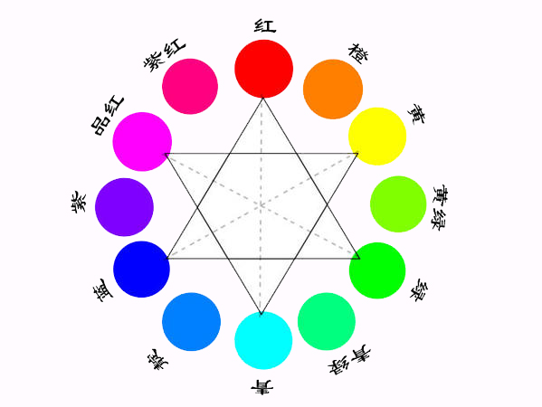

# 光和色

光和色是一切美术的基础，就像空气至于我们一样，所以对于光色的理解是学习Photoshop的基础。

## 颜色三属性

颜色三属性为：色相、饱和度、明度。

- 色相（Hue）就是我们直接看到的红色、黄色、绿色等。
- 饱和度（Saturation）指的是颜色的鲜艳程度，比如有些手机找出来的照片颜色很鲜艳，说的就是饱和度高。
- 明度（Brightness）指的是暗和亮，图片暗说明明度低，图片亮说明明度高。

**颜料三原色**：红黄蓝

**光色三原色**：红蓝绿（Red Green Blue）

**印刷三原色**：青、品红、黄

## 色环

如下图所示的就是一个色环：

在色相环上，在直径上的两个色称为互补色，互补色之间完全相互吸收，一种光射到它的互补光上会被互补光完全吸收。

## 颜色模型

一种颜色模型对应一种媒介，一共有HSB、RGB、CMYK、LAB四种颜色模型。

- HSV 模型对应人眼，是对
- RGB 模型对应光
- CMYK 模型对应印刷色
- LAB 模型对应大自然色

上述几种颜色模型中，在色彩范围上：LAB > RGB > CMKY 。因为RGB、CMKY、LAB等颜色模型都有自己的色彩范围，所以如果有些颜色可以被看到，但是不能被印刷出来，这种情况叫做溢色。所以你做的东西需要印刷出来，那么买本《色标手册》还是有必要的。

[颜色模型_百度百科](http://baike.baidu.com/view/1985217.htm)

<!-- 其中，RGB是加色模式，CMY是减色模式。-->

### RGB模型

- RGB模型中RGB(0,0,0)是黑色、RGB(255,255,255)是白色。
- RGB数值相同时表示的颜色是灰色，数值越高，就是越接近黑色的深灰，数值越低，就是越接近白色的浅灰（灰色是没有色相的）。

### CMYK模型

CMYK中的K表示黑色。因为CMY都为100%不能印刷出纯黑色，因此就加入了K这个纯黑色。因此，如果要印刷出黑色的字体，则CMYK的比例是：0、0、0、100。

NOTE：PhotoShop 主要是图像的合成软件，更加倾向于图像的合成。而Illustrator是图像创作软件。

## 分辨率单位

- PPI（Pixels Per Inch）表示每英寸所拥有的像素数目。
- DPI（Dots Per Inch）表示鼠标每移动一英寸指针在屏幕上移动的点数。
- LPI（Lines Per Inch）表示每英寸上等距离排列多少条网线，经常应用在商业印刷领域上。

NOTE：做印刷品的设计时，要在上下各留3毫米的出血。所以如果要设计10CM*10CM的印刷海报，那么建立文档时要建10.6CM*10.6CM的大小。

  

 