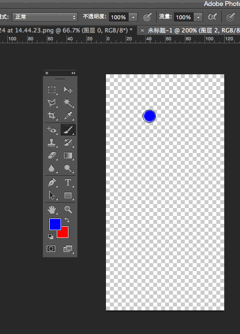
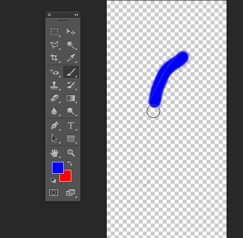
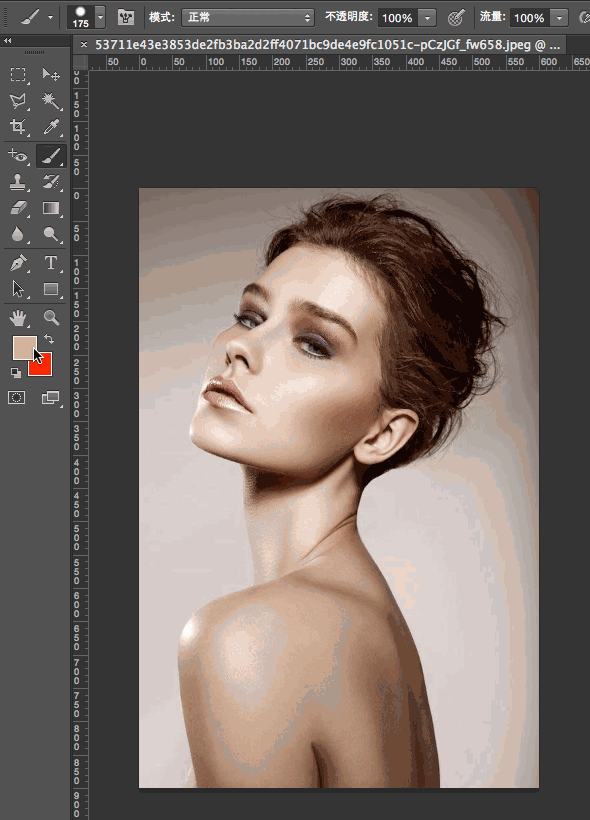
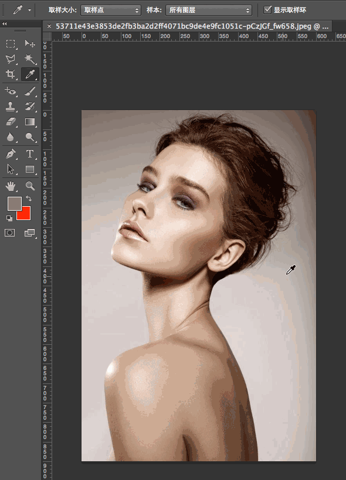
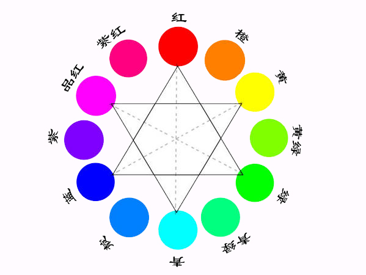
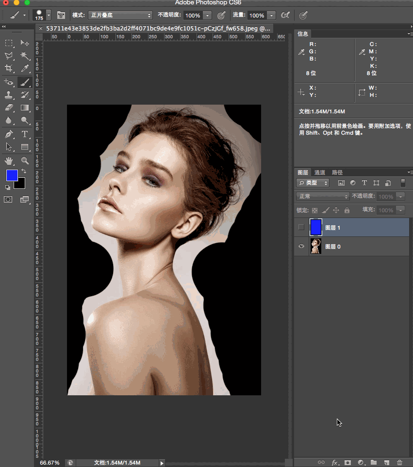

# 绘画与修饰工具

- 选取和移动工具组
- 绘画和修饰工具组
- 矢量工具组
- 辅助工具组

其中重点是绘画和修饰工具组

## 修复工具组

常用来修照片，用于去除粉刺、黑头等

- 污点修复画笔工具

使用方法：按住鼠标涂抹需要修复的区域，松手后自动修复

- 修复画笔工具

使用方法：按住alt选择取样点，选好之后按住鼠标涂抹修复区域。

NOTE：
1.与污点修复画笔工具不同的是其有个取样点，所以修复画笔工具修复之后的区域会有取样点的纹理。
2.有一个印章工具与修复画笔工具使用方式一样，但是效果不一样。印章工具是直接把取样点的图像复制过来，而修复画笔工具除了会将图像复制过来，它还会根据修复区域周围的皮肤进行融合。

- 修补工具

使用方法：按住鼠标将修复区域圈起来

- 红眼工具

使用方法：直接点击红眼区域

总结：污点修复工具、修补工具类似，而修复画笔工具多了取样点。就使用的便利性来说，污点修复工具最为简单。但使用效果都差不多，所以选择自己顺手的工具就可以了。

## 画笔工具

画笔工具重在修饰，画笔工具的核心是用画笔工具的模型去修饰（编辑->正片叠底等）。

选择很重要，蚂蚁线不重要。指的是通过各种方式去选择，而不单单只通过蚂蚁线去选择。

修一个人的嘴唇为烈焰红唇。

- 第1组：正常、溶解、背后、清除（背后、清除都必须在图层上才能使用）
- 第2组：变暗、正片叠底、颜色加深、线性加深
- 第3组：变亮、滤色、颜色减淡、线性减淡
- 第4组：叠加、柔光、强光、亮光、线性光、点光、实色混合（关于光的）
- 第5组：差值、排除
- 第6组：色相、饱和度、颜色、亮度（基于人眼的模式）

### 溶解

就像溶解效果一样

### 背后

所有操作都会像在图层背后操作一样

NOTE：背后效果必须在图层上才能操作，不能在背景上操作

### 清除

相当于橡皮擦

### 变暗、变亮

变暗指的是：取一个色，画面上所有比这个色亮的全都变暗，所有比这个色暗的色的不变。

变亮指的是：与变暗相反。画面上所有比这个色暗的全都变亮，所有比这个色亮的色的不变。

### 正片叠底、滤色

正片叠底基于减色、滤色基于加色。

**正片叠底**

正片叠底最终是黑色，黑色直接上去就是黑色，白颜色上不去。

**滤色**

两个色用滤色模式叠加，就是色环中两个色的中间颜色。

滤色最终是白色，白色直接上去就是白色，黑色上不去。

上面的演示中，在蓝色背景图层更改模式为滤色后，直接把上一图层上的黑色全部清除了（因为黑色上不去）。

